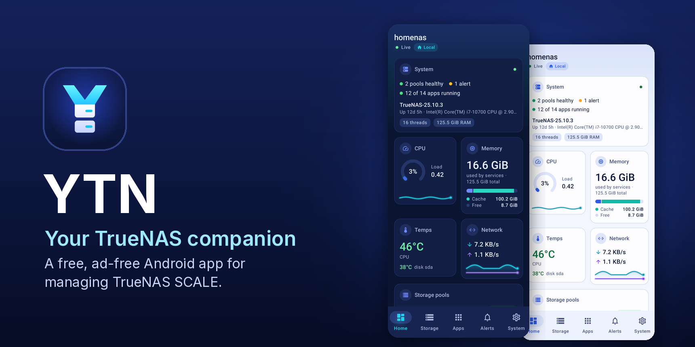
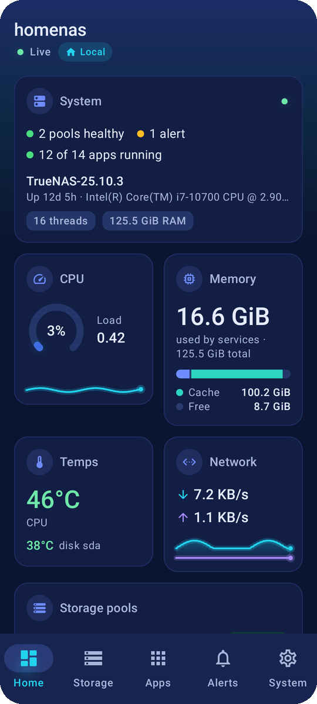
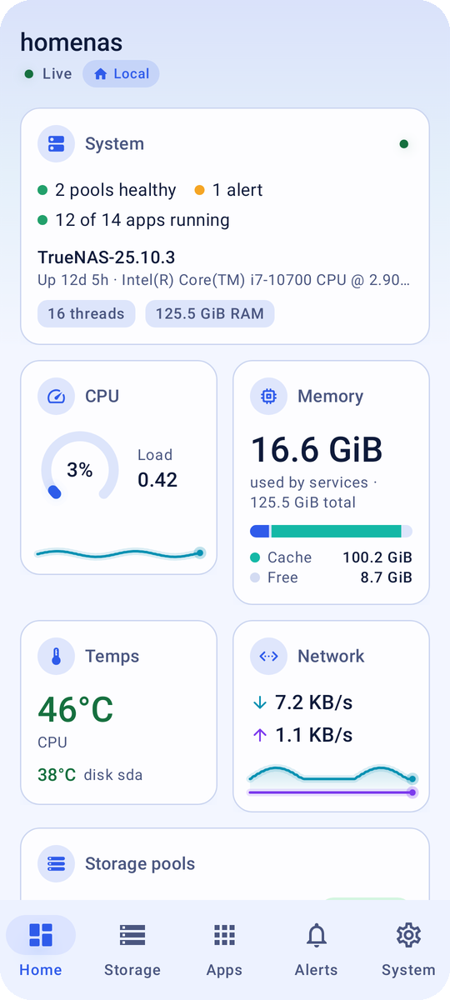
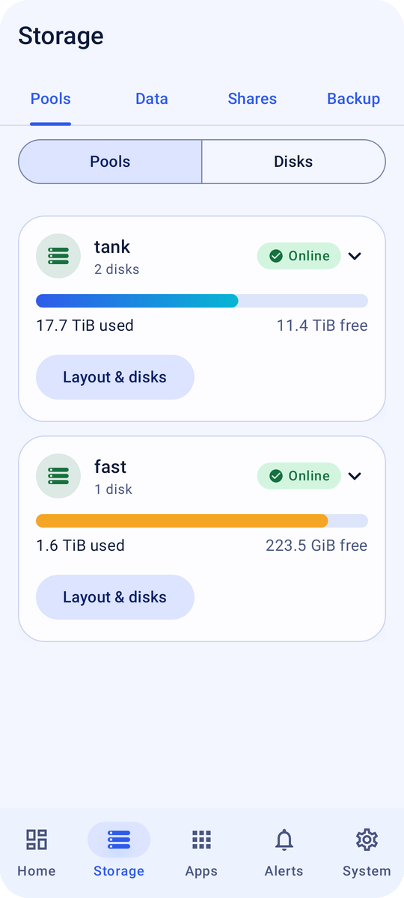
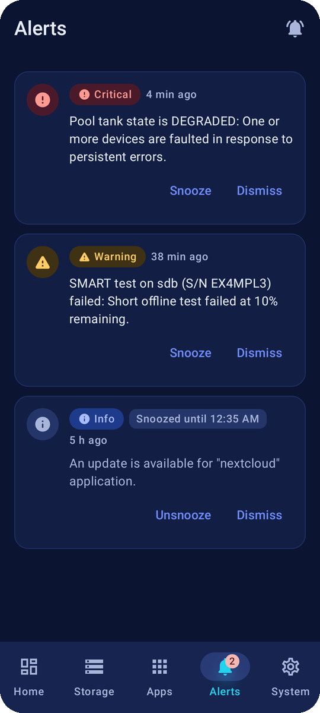
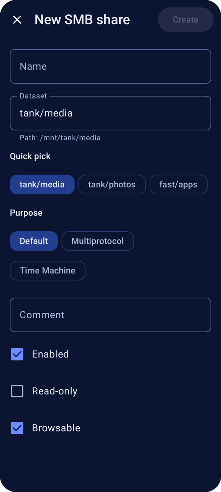
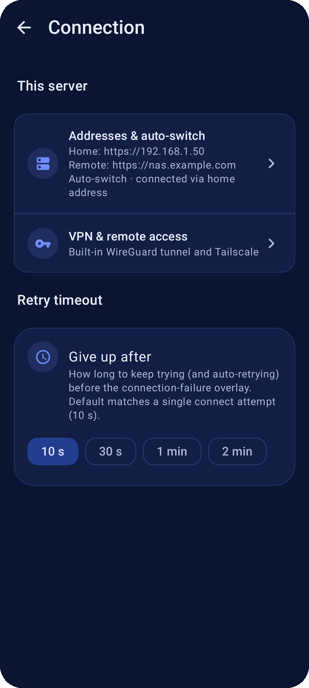
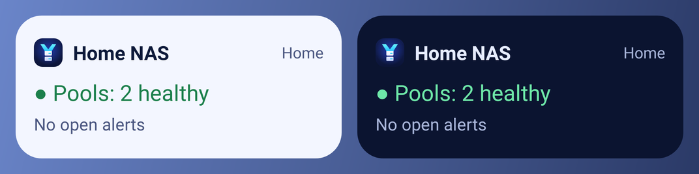

  

<h1 align="center">YTN</h1>

  <b>Your TrueNAS companion.</b> 
  A free, ad-free Android app to keep an eye on your <b>TrueNAS</b> server and look after it from your phone.

  <a href="https://github.com/1immortal/ytn/releases/latest"><b>⬇ Download the latest version</b></a>

> [!TIP]
> **New name, same app.** YTN used to be called *TrueNAS Companion*. If you already have it, just update as usual: it installs over the old version and keeps your servers and settings. Look for the new blue **Y** icon on your home screen.

## A quick tour

<table>
  <tr>
    <td align="center"> <b>Home</b>: health, pools and live stats</td>
    <td align="center"> …in light mode too</td>
    <td align="center"> <b>Storage</b>: pools, disks, data, shares, backup</td>
    <td align="center"> <b>Alerts</b>: snooze, dismiss, get notified</td>
  </tr>
  <tr>
    <td align="center"> <b>System</b>: every setting on one screen</td>
    <td align="center"> <b>Backup</b>: snapshots, scrubs, sync</td>
    <td align="center"> <b>Apps</b>: install, update, logs</td>
    <td align="center"> <b>Shares</b>: simple full-screen editors</td>
  </tr>
  <tr>
    <td align="center"> <b>Services</b>: start, stop, settings</td>
    <td align="center"> <b>Scheduled tasks</b> in plain words</td>
    <td align="center"> <b>Connection</b>: home, away and VPN</td>
    <td align="center"> <b>Phone alerts</b>, straight from your NAS</td>
  </tr>
</table>

 A home-screen widget shows your NAS at a glance (it follows your light or dark theme).

Screenshots use made-up example data.

## What you can do

- 📊 **See how your NAS is doing** at a glance: health, pools, free space, apps, CPU, memory, network and temperatures, plus reports for the last hour, day, week or month.
- 🔔 **Get alerts on your phone** when a pool degrades, a disk runs hot or space runs low, straight from your NAS with no cloud service in between. Snooze or dismiss them in one tap, and undo it if you tapped the wrong one.
- 💾 **Look after your storage**: pools and disks, datasets, SMB, NFS and iSCSI shares, a file browser, and a step-by-step guide for replacing a failing disk.
- 🛟 **Keep your data safe**: snapshots, scrubs, SMART tests, replication to another NAS and cloud sync, with a clear "when did this last run" overview.
- 🧩 **Manage apps, VMs and containers**: install and update apps, read logs, start and stop VMs, open a terminal.
- ⚙️ **Handle the everyday chores**: services, scheduled tasks, users and groups, certificates, updates, reboot and shut down.
- 🌐 **Check your network settings**: interfaces, addresses, gateways, DNS and routes at a glance, view only, so nothing on your phone can cut your NAS off the network.
- 🏠 **Works at home and away**: uses your home address on your Wi-Fi and your remote address everywhere else, with an optional built-in VPN (WireGuard or Tailscale) so your NAS doesn't have to be open to the internet.
- 🔒 **Private and secure**: sign in with your TrueNAS account (with two-factor codes), lock the app with your fingerprint, and everything stays encrypted on your phone.
- 🎨 **Looks at home on your phone**: light and dark themes, colours from your wallpaper, a themed icon, large-font and TalkBack friendly.

Want the full list? See **[everything YTN can do](docs/FEATURES.md)**.

## Get the app

1. On your phone, open the [latest release](https://github.com/1immortal/ytn/releases/latest) and download **`truenas-companion-release.apk`**. (The file keeps its old name so that existing installs keep updating.)
2. Open the downloaded file. Android asks you to allow **Install unknown apps** for your browser or file manager. Allow it, go back, then tap **Install**.
3. That's it. YTN lets you know when there's a new version (System › About) and installs it over the old one, keeping your settings.

You need Android 8.0 or newer and TrueNAS 25.04 or newer.

**Updating from TrueNAS Companion?** Nothing to do: update from inside the app or install the new file over it. The app is now called **YTN** on your home screen, with a new icon.

Preview builds, and older versions

- **Preview builds:** `truenas-companion-debug.apk` is a separate app ("YTN Preview") with extra diagnostics. It can sit next to the normal app. Pick the matching channel in System › About › Update channel.
- **Coming from 0.x (before 1.0.0)?** Those builds used a different signing key: uninstall once, then install the release APK and add your server again.
- **HTTPS only (since 1.7.1):** the app only signs in over `https://`. TrueNAS serves HTTPS out of the box, so this usually just means using `https://` in the address.

## Getting started

1. **Add your server.** Tap *Add server* and enter the address you use for the TrueNAS web UI, for example `https://truenas.local` or `https://nas.example.com`. If your NAS uses its own certificate, the app shows its fingerprint and asks you to trust it once.
2. **Sign in** with your TrueNAS username and password (and your two-factor code if you use 2FA). The app stays signed in for as long as you choose (1, 7 or 30 days).
3. **Optional extras** (System › Connection and System › Phone alerts): add your home address for faster connections at home, set up a VPN for access from anywhere, and choose which alerts reach your phone.

## Privacy

YTN talks only to the servers you add. There are no ads, analytics, tracking or accounts. Your passwords, keys and sessions stay encrypted on your phone. The only other requests are for app icons from TrueNAS's own catalog servers and a once-a-day check with GitHub for a newer version (you can turn it off). Neither sends any personal data.

> [!NOTE]
> **Found a problem?** If you run into a bug or something doesn't work as expected, please [open an issue](https://github.com/1immortal/ytn/issues) on this repo. It helps to include the app version (System › About), your Android version and what you were doing. **Please never post passwords, OTP (2FA) codes, API keys or your server addresses**, not even in screenshots or logs.

## More

- [Everything YTN can do](docs/FEATURES.md)
- [Technical details](docs/TECHNICAL.md): how it works, sign-in and sessions, supported TrueNAS versions, security notes and known limitations
- [Building from source](docs/BUILDING.md)

## About

Designed and built by Grok Bot. Thanks for trying it out!

YTN is an independent project, not affiliated with or endorsed by iXsystems. TrueNAS is a trademark of iXsystems, Inc.

## License

MIT. See [LICENSE](LICENSE).
