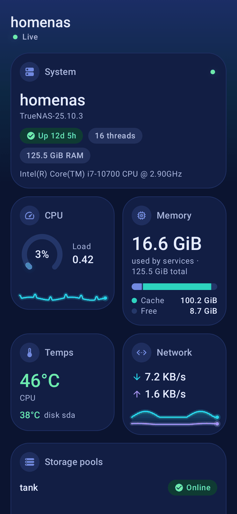
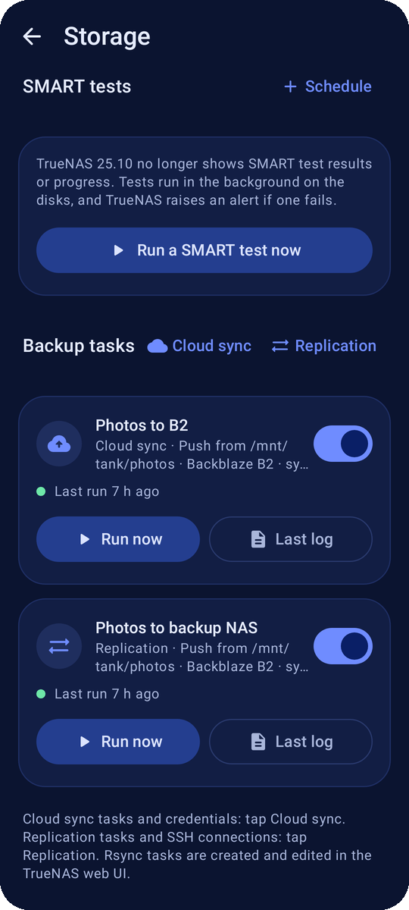
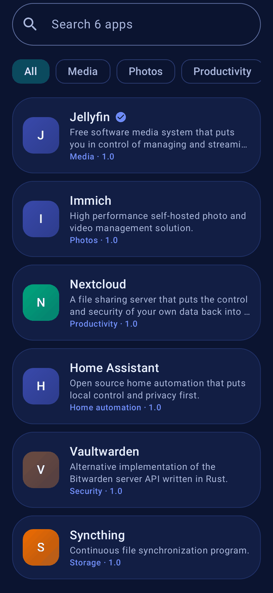
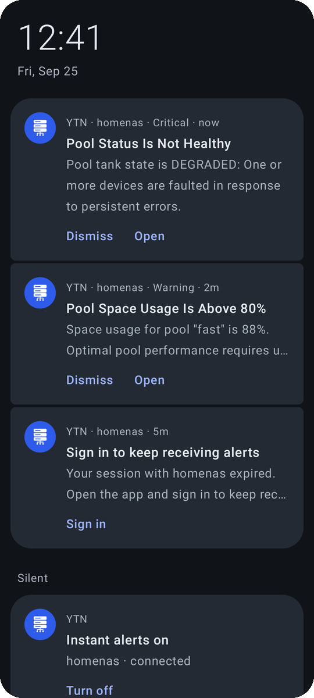

  

<h1 align="center">TrueNAS Companion</h1>

  A free, ad-free Android app to manage your <b>TrueNAS SCALE</b> server from your phone.

  Designed and built by Grok Bot

  <a href="https://github.com/1immortal/truenas-companion/releases/latest"><b>Download the latest APK</b></a>

<table>
  <tr>
    <td></td>
    <td></td>
    <td></td>
    <td></td>
  </tr>
</table>
Screenshots use made-up example data.

## What you can do

- **See how your NAS is doing at a glance.** Live CPU, memory, network and temperatures, plus pool health and free space, on a dashboard you can rearrange.
- **Get alerts on your phone.** A notification when a pool degrades, a disk runs hot or space runs low, straight from your NAS with no cloud service in between.
- **Manage your apps.** Browse the catalog, install, update, edit, roll back, read logs and see live resource use.
- **Control VMs and containers.** Start, stop, restart, edit resources or create a simple VM.
- **Keep your data safe.** See at a glance when the last snapshot, scrub and backup ran and whether anything failed. Take, roll back, clone and delete snapshots, schedule snapshot tasks, start or pause scrubs, run SMART tests and kick off replication, cloud sync or rsync backups.
- **Keep an eye on storage.** Pools, disks with temperatures, and datasets.
- **Handle everyday chores.** Start or stop services, follow running tasks, dismiss alerts, reboot or shut down.
- **Works at home and away.** Add a local address and the app uses it on your home Wi-Fi, then switches to your remote address everywhere else.
- **Reach your NAS safely from anywhere.** The app has WireGuard built in and can set up a VPN on your TrueNAS for you (wg-easy or Tailscale), so you don't have to open TrueNAS to the internet. Only the app's own traffic to your NAS uses the tunnel, and it only switches on when it's needed.
- **Stays secure.** Sign in with your TrueNAS username, password and two-factor code (or an API key), lock the app with your fingerprint, and keep all credentials encrypted on the device.
- **Stays up to date.** The app tells you when a new version is out and installs it for you after checking that it's genuine.
- **Looks good.** Material You design with light and dark themes.

## Get the app

1. On your phone, open the [latest release](https://github.com/1immortal/truenas-companion/releases/latest) and download the `.apk` file.
2. Open the downloaded file. Android asks you to allow **Install unknown apps** for your browser or file manager. Allow it, go back, then tap **Install**.
3. From then on the app lets you know about new versions (System › About › Check for updates) and installs them over the old one, keeping your settings.

Needs Android 8.0 or newer and TrueNAS SCALE (25.04 or newer is recommended for live stats and password sign-in).

> [!NOTE]
> **Found a problem?** If you run into a bug or something doesn't work as expected, please [open an issue](https://github.com/1immortal/truenas-companion/issues) on this repo. It helps to include the app version (System › About), your Android version and what you were doing. Please never post passwords, 2FA/OTP codes, API keys or your server addresses.

## Getting started

1. **Add your server.** Tap *Add server* and enter the address you use for the TrueNAS web UI, for example `https://truenas.local` or `https://nas.example.com`. If your NAS uses its own self-signed certificate, the app shows its fingerprint and asks you to trust it once.
2. **Sign in.** Use your TrueNAS username and password, and enter your two-factor code if you have 2FA on. The app then stays signed in for the period you choose (1, 7 or 30 days).
3. **Optional: add a local address.** If you reach your NAS through a reverse proxy or domain from outside, add its home address too (the app can find it for you). At home the app connects directly for extra speed.
4. **Optional: turn on phone alerts** in the app's settings, and pick which alerts matter to you.
5. **Optional: set up a VPN.** In the server's settings tap *VPN › Set up VPN* while you're at home. The app installs WireGuard (or Tailscale) on your NAS and sets up your phone. For WireGuard you add one setting on your router yourself: forward UDP port 51820 to your NAS. [Details](docs/TECHNICAL.md#features-in-detail).

## Privacy

The app talks only to the servers you add. There are no ads, analytics, tracking or accounts. Your passwords, keys and sessions stay encrypted on your phone. The only other requests the app makes are for app icons, which come from TrueNAS's own catalog servers, and a once-a-day check with GitHub for a newer app version (you can turn it off). Neither sends any personal data. The built-in VPN connects only to your own NAS and carries only the app's traffic to it.

## More

- [Technical details](docs/TECHNICAL.md): how every feature works, sign-in and sessions, supported TrueNAS versions, security notes and known limitations.
- [Building from source](docs/BUILDING.md)
- Found a bug or have an idea? [Open an issue](https://github.com/1immortal/truenas-companion/issues).

TrueNAS Companion is an independent project and is not affiliated with or endorsed by iXsystems. TrueNAS is a trademark of iXsystems, Inc.

## About

TrueNAS Companion was designed and built by Vert, an AI assistant in Grok Bot, for [@1immortal](https://github.com/1immortal). Thanks for trying it out!

## License

MIT. See [LICENSE](LICENSE).
