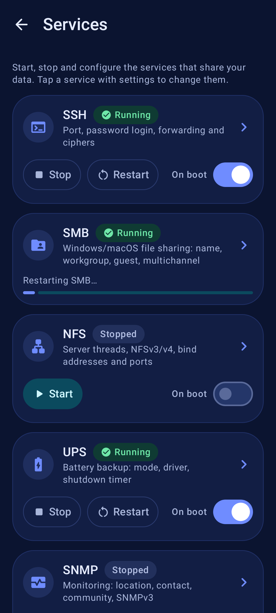
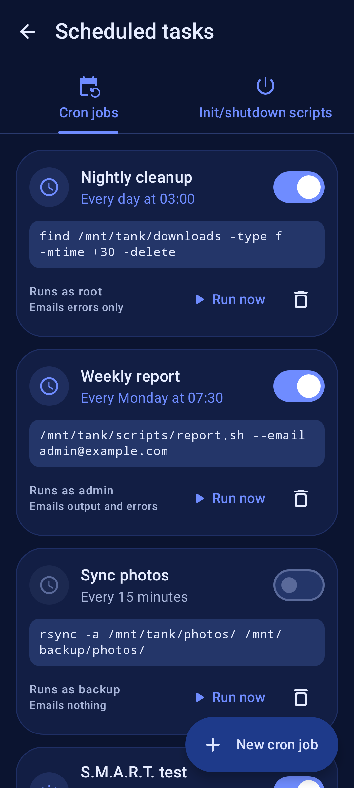
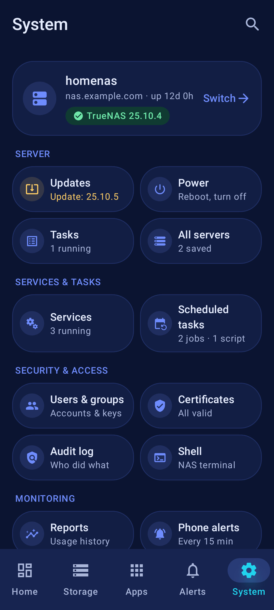

  

<h1 align="center">TrueNAS Companion</h1>

  A free, ad-free Android app to manage your <b>TrueNAS SCALE</b> server from your phone.

  <a href="https://github.com/1immortal/truenas-companion/releases/latest"><b>Download the latest APK</b></a>

<table>
  <tr>
    <td></td>
    <td></td>
    <td></td>
    <td></td>
  </tr>
  <tr>
    <td></td>
    <td></td>
    <td></td>
  </tr>
</table>
Screenshots use made-up example data.

## What you can do

- **See how your NAS is doing at a glance.** Live CPU, memory, network and temperatures, plus pool health and free space, on a dashboard you can rearrange. A **home-screen widget** shows pool health and open alerts.
- **Watch several servers.** System › All servers lists every saved NAS with status and alert counts; tap one to open it.
- **Get alerts on your phone.** A notification when a pool degrades, a disk runs hot or space runs low, straight from your NAS with no cloud service in between.
- **Manage your apps.** Browse the catalog, install, update, edit, roll back, read logs and see live resource use.
- **Open a terminal.** A shell on the NAS, in an app's container, or in an Incus container, like the TrueNAS web UI. With the app lock on it asks for your fingerprint first, and the session closes when you leave.
- **Control VMs and containers.** Start, stop, restart, edit resources or create a simple VM.
- **Keep your data safe.** See at a glance when the last snapshot, scrub and backup ran and whether anything failed. Take, roll back, clone and delete snapshots, schedule snapshot tasks, start or pause scrubs, run SMART tests and kick off replication, cloud sync or rsync backups.
- **Back up to the cloud.** Storage › Protection › **Cloud sync** sets up TrueNAS cloud sync from your phone.
  - Add credentials for S3 (and S3-compatible storage like MinIO or Wasabi), Backblaze B2, Google Drive, Dropbox, OneDrive, SFTP, WebDAV, Storj, Azure Blob, pCloud and more. **Verify** checks them before you save. Keys and passwords stay hidden until you tap **Show**.
  - For Google Drive, Dropbox, OneDrive and other sign-in providers, paste a token from `rclone authorize` or add the credential once in the web UI. The app explains how.
  - Create and edit tasks: push or pull, sync/copy/move explained in plain words, the NAS folder picked from your pools, bucket and folder picked by browsing the cloud, a schedule picker, snapshot first, include/exclude, bandwidth limits, encryption and scripts.
  - **Run now**, **Dry run**, **Abort** and **Restore**, with live progress. You can get a notification when a run you started finishes.
- **Replicate snapshots to another NAS.** Storage › Protection › **Replication** sets up ZFS replication from your phone.
  - SSH connections: connect to another TrueNAS by signing in to it once (the app has the NAS generate a key and install it there), or set up any SSH server by hand with **Discover** for its host key. Generate or paste key pairs; private keys stay hidden until you tap **Show**. A connection or key that's still in use can't be deleted.
  - Create and edit tasks: push or pull, over SSH, SSH+netcat or to another pool on this NAS. Pick the source datasets from a tree and browse the target datasets on the other system. Run after a periodic snapshot task, on a schedule or only when started; retention, encryption, properties, compression and speed limit. *Allow from scratch* comes with a strong warning.
  - **Run now** and **Replicate once without saving**, with live progress, the last log and an optional notification when it finishes. **Restore…** creates the reverse task.
- **Share disks over iSCSI.** Storage › Shares › **iSCSI** shows the iSCSI service, targets and connected initiators, with **Share a disk** to set everything up in one go.
  - The wizard creates a new zvol (or uses an existing zvol, or a new file), the portal, the allowed initiators and optional CHAP, then the target with the disk as LUN 0. If a step fails, everything it created is removed again.
  - Manage targets (portal groups, initiators, CHAP), extents (zvol or file, size, block size, read-only and more), LUNs, portals, initiator groups and CHAP users (secrets stay hidden until you tap **Show**), plus the global settings and the list of connected initiators.
  - Deleting asks first and says what happens: zvols are always kept, a file is deleted only if you tick the box, and objects in use or with connected initiators need an extra confirmation or are blocked.
- **Keep an eye on storage.** Pools, disks with temperatures, and a full dataset/ZVOL browser (used/available, compression). Create, rename and delete datasets; manage SMB and NFS shares linked to them.
- **Browse your files.** Open any pool or dataset in **Storage › Files**, or tap *Browse files* on a dataset or share.
  - Folders and files with size, date and type; sort by name, size or date and search the folder you're in.
  - Peek at text files and photos without leaving the app, or open a file in another app.
  - **Save to Downloads** with one tap, or pick any folder with **Save as…**.
  - Upload a file from your phone and create folders. You see progress and can cancel. If you stop an upload halfway, the app tells you that an incomplete file stays on the NAS.
  - TrueNAS system folders stay hidden unless you ask for them.
  - Deleting, renaming and moving files isn't available, because TrueNAS 25.10 doesn't offer a way to do that through its API. Use an SMB/NFS share or the TrueNAS shell for those.
- **Replace a failing disk, step by step.**
  - Every disk shows its model, serial, size, type, pool, status, temperature and error counts, and each pool shows its layout.
  - A guided wizard walks you through a swap: pick the disk, optionally take it offline, insert the new one, scan, double-check the serial and size, and confirm with your fingerprint.
  - It won't let you pick a disk that's too small and warns you if the "new" disk looks like the old one.
  - Follow the resilver live, and get a notification when it's done. A disk alert takes you straight there.
- **Run your services.** **System › Services** shows SSH, SMB, NFS, UPS, SNMP, FTP and the rest, whether each one is running and whether it starts on boot.
  - Start, stop or restart a service with one tap and watch it happen. Before stopping something like SSH or SMB, the app warns you that it may cut off access.
  - Tap SSH, SMB, NFS, UPS, SNMP or FTP to change its settings: port and password login, workgroup and multichannel, NFS versions, UPS driver and shutdown timer, SNMPv3, FTP limits and more.
  - Passwords stay hidden until you tap **Show**. If TrueNAS doesn't accept a value, the reason shows up right under that field.
- **Schedule tasks.** **System › Scheduled tasks** holds your cron jobs and init/shutdown scripts.
  - Every cron job reads in plain words ("Every day at 03:00", "Weekdays at 06:30"). Turn it on or off, or run it right now: the app asks first, then shows progress and the output.
  - Add or edit a job with a simple schedule picker (hourly, daily, weekly, monthly or your own custom schedule), and pick the user it runs as.
  - Init/shutdown scripts run a command or a script file when the NAS starts up or shuts down. You can pick the script file straight from your pools.
  - TrueNAS 25.10 has no way to run an init/shutdown script on demand, so the app doesn't offer that.
- **Manage users and groups.** Add, edit, lock or delete accounts, reset passwords, paste SSH keys and pick groups, home folder and shell. Built-in system accounts stay out of the way unless you ask to see them.
- **Look back in time.** Reports show CPU, memory, network, disk activity and temperatures for the last hour, day, week or month. Pinch to zoom and touch the chart for exact values. Open them from System › Reports or by tapping the CPU, Memory, Network or Reports cards.
- **See who did what.** The audit log lists sign-ins, changes, SMB file access and sudo use, with the same filters as the web UI. One tap on **REST logins** shows which old scripts still use the deprecated REST API, and you can export the list as a CSV.
- **Keep certificates fresh.** See every certificate with who issued it, the names it covers and how many days are left, with a heads-up before one expires. Import a certificate, request one from Let's Encrypt with your DNS provider, or switch the web UI certificate (with a clear warning, and the app makes you re-check the new one).
- **Do things faster.** Long-press the app icon for Shell, Alerts, Restart app… or Scrub pool…, or add the NAS status and TrueNAS action tiles to Quick Settings. Every action still asks first, with your fingerprint when the app lock is on.
- **Calmer alerts.** Snooze an alert right from the notification, see repeated alerts as one notification with a count, and tap through to the pool, disk, app, dataset, update or certificate it's about (or straight into the disk replacement when a pool reports a failed disk).
- **Handle everyday chores.** Check for TrueNAS updates and apply them, manage boot environments, follow running tasks, dismiss alerts, reboot or shut down.
- **Find any setting fast.** The System tab fits on about one screen: your server at the top, then short groups (Server, Services & tasks, Security & access, Monitoring, App). Each tile shows a live hint such as "Update: 25.10.5", "3 running" or "2 jobs · 1 script", and the search button finds things by everyday words ("reboot", "dark", "cron").
- **Works at home and away.** Add a local address and the app uses it on your home Wi-Fi, then switches to your remote address everywhere else. If a saved server can’t be reached, a modal blurred overlay blocks the UI underneath (including the bottom tabs, which are grayed out and not clickable) and offers **Quit**, **Check connection settings**, or **Try again**. System › Connection sets how long to keep retrying (10 s / 30 s / 1 min / 2 min) before that overlay.
- **Reach your NAS safely from anywhere.** The app has WireGuard built in and can set up a VPN on your TrueNAS for you (wg-easy or Tailscale), so you don't have to open TrueNAS to the internet. Only the app's own traffic to your NAS uses the tunnel, and it only switches on when it's needed.
- **Stays secure.** Sign in with your TrueNAS username, password and two-factor code (or an API key), lock the app with your fingerprint, and keep all credentials encrypted on the device.
- **Stays up to date.** The app tells you when a new version is out and installs it for you after checking that it's genuine. In **System › About** you can pick the **Release** or **Debug** update channel (default matches the build you installed). Mixing channels usually requires uninstalling first.
- **Looks good.** Material You design with light and dark themes.

## Get the app

1. On your phone, open the [latest release](https://github.com/1immortal/truenas-companion/releases/latest) and download **`truenas-companion-release.apk`** (recommended) or **`truenas-companion-debug.apk`** for developers. Asset names are the same on every release.
2. Open the downloaded file. Android asks you to allow **Install unknown apps** for your browser or file manager. Allow it, go back, then tap **Install**.
3. From then on the app lets you know about new versions (System › About › Check for updates) and installs them over the old one, keeping your settings.

Needs Android 8.0 or newer and TrueNAS 25.04 or newer (the app only uses the JSON-RPC WebSocket API, never the deprecated REST API).

> [!IMPORTANT]
> **Signing key change in 1.0.0.** Release APKs from 1.0.0 onwards are signed with a new key. If you installed 0.x (debug-signed) builds, Android will not let the in-app updater replace them — uninstall once, then install the release APK. Add your server again afterwards. From then on, updates install normally.
>
> **Update channels (1.0.3).** Releases publish stable asset names: `truenas-companion-release.apk` and `truenas-companion-debug.apk` (plus matching `.sha256` files). Older versioned filenames (`truenas-companion-vX.Y.Z*.apk`) are deprecated. Release and Debug use different package ids and signing keys — switching channels usually requires uninstalling the other build first. The in-app updater’s **System › About › Update channel** setting must match the APK you want.

> [!NOTE]
> **Found a problem?** If you run into a bug or something doesn't work as expected, please [open an issue](https://github.com/1immortal/truenas-companion/issues) on this repo. It helps to include the app version (System › About), your Android version and what you were doing. Please never post passwords, 2FA/OTP codes, API keys or your server addresses.

## Getting started

1. **Add your server.** Tap *Add server* and enter the address you use for the TrueNAS web UI, for example `https://truenas.local` or `https://nas.example.com`. If your NAS uses its own self-signed certificate, the app shows its fingerprint and asks you to trust it once. After that, the saved pin is **masked** in connection settings (tap **Show** to reveal); **Forget** still clears it.
2. **Sign in.** Use your TrueNAS username and password, and enter your two-factor code if you have 2FA on. The app then stays signed in for the period you choose (1, 7 or 30 days).
3. **Optional: add a local address.** If you reach your NAS through a reverse proxy or domain from outside, add its home address too (the app can find it for you). At home the app connects directly for extra speed.
4. **Optional: turn on phone alerts** in the app's settings, and pick which alerts matter to you.
5. **Optional: set up a VPN.** In the server's settings tap *VPN › Set up VPN* while you're at home. The app installs WireGuard (or Tailscale) on your NAS and sets up your phone. For WireGuard you add one setting on your router yourself: forward UDP port 51820 to your NAS. [Details](docs/TECHNICAL.md#features-in-detail).

## Privacy

The app talks only to the servers you add. There are no ads, analytics, tracking or accounts. Your passwords, keys and sessions stay encrypted on your phone. The only other requests the app makes are for app icons, which come from TrueNAS's own catalog servers, and a once-a-day check with GitHub for a newer app version (you can turn it off). Neither sends any personal data. The built-in VPN connects only to your own NAS and carries only the app's traffic to it.

## More

- [Technical details](docs/TECHNICAL.md): how every feature works, sign-in and sessions, supported TrueNAS versions, security notes and known limitations.
- [Building from source](docs/BUILDING.md)
- Found a bug or have an idea? [Open an issue](https://github.com/1immortal/truenas-companion/issues).

TrueNAS Companion is an independent project and is not affiliated with or endorsed by iXsystems. TrueNAS is a trademark of iXsystems, Inc.

## About

TrueNAS Companion was designed and built by Grok Bot. Thanks for trying it out!

## License

MIT. See [LICENSE](LICENSE).
